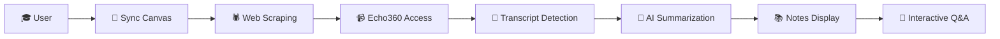

# 🎓 AI Course Companion

> Transform your lecture recordings into interactive study sessions with AI-powered summarization and Q&A

[](https://www.python.org/)
[](https://fastapi.tiangolo.com/)
[](https://reactjs.org/)
[](https://www.typescriptlang.org/)
[](LICENSE)

---

## 🎬 Demo Video

<div align="center">

### 📹 Watch the Full Application Demo

[](https://youtu.be/q69QUi9UMcY)

**▶️ [Click to Watch on YouTube](https://youtu.be/q69QUi9UMcY)**

*See the complete flow: Canvas Sync → Web Scraping → Auto-Summarization → Interactive Q&A*

---

**🎯 What's in the demo:**
- 🔄 One-click Canvas account sync
- 🕷️ Intelligent web scraping in action
- 📝 Auto-detection of lecture transcripts
- 🤖 Real-time AI summarization with GPT-4
- 💬 Interactive Q&A with course material

</div>

---

## ✨ What is AI Course Companion?

**AI Course Companion** is an intelligent learning platform that automatically:
- 🔄 **Syncs** with your Canvas LMS account
- 🎥 **Scrapes** Echo360 lecture recordings
- 📝 **Transcribes** video content to text
- 🤖 **Summarizes** lectures using advanced AI (GPT-4 + RAG)
- 💬 **Answers** your questions about course material in real-time

**Perfect for students who want to:**
- Review lectures 10x faster
- Get instant answers without rewatching hours of video
- Study smarter with AI-generated notes
- Never miss important concepts from recordings

---

## 🚀 Key Features

### 1. **One-Click Canvas Sync**
Automatically discovers and syncs all your Canvas courses with a single click. No manual course entry required.

### 2. **Intelligent Web Scraping**
Advanced Selenium-based scraper navigates through Canvas → Echo360 to reach lecture recordings, handling authentication and multi-page workflows.

### 3. **AI-Powered Summarization**
Leverages GPT-4 with Retrieval-Augmented Generation (RAG) to create comprehensive, accurate lecture summaries with key points, concepts, and timestamps.

### 4. **Interactive Q&A**
Ask questions about your lectures in natural language. The AI understands context and provides detailed answers citing specific parts of the transcript.

### 5. **Beautiful Modern UI**
Dark-themed, responsive interface built with React + TypeScript + Tailwind CSS for an exceptional user experience.

### 6. **Real-Time Processing**
Watch as your courses sync, transcripts process, and summaries generate in real-time with animated progress indicators.

---

## 🎯 How It Works



### The Complete Flow:

1. **🔐 Authentication**: User provides Canvas credentials
2. **🔄 Sync**: System fetches all enrolled courses
3. **🕷️ Scrape**: Advanced scraper navigates to Echo360 recordings
4. **📝 Transcribe**: Extracts lecture transcripts (if available)
5. **🤖 Summarize**: GPT-4 + RAG generates comprehensive notes
6. **📚 Display**: Beautiful interface shows organized summaries
7. **💬 Q&A**: Ask anything about the lecture content

---

## 🛠️ Tech Stack

### Backend
- **FastAPI** - High-performance async API framework
- **Python 3.9+** - Core backend language
- **Selenium WebDriver** - Intelligent web scraping
- **OpenAI GPT-4** - Advanced language understanding
- **ChromaDB** - Vector database for RAG
- **LangChain** - LLM orchestration framework

### Frontend
- **React 18** - Modern UI library
- **TypeScript** - Type-safe JavaScript
- **Vite** - Lightning-fast build tool
- **Tailwind CSS** - Utility-first styling
- **Lucide Icons** - Beautiful icon library
- **Axios** - HTTP client

### Key Technologies
- **RAG (Retrieval-Augmented Generation)** - Enhances AI accuracy
- **ChromaDB Vector Store** - Semantic search capabilities
- **WebDriver** - Browser automation for scraping
- **Async/Await** - High-performance async operations

---

## 📸 Screenshots

### 🏠 Landing Page
*Modern, gradient-rich landing page with clear call-to-action*

> **[Add screenshot here: Landing page with "Get Started" button]**

---

### 🔄 Canvas Sync
*Real-time sync progress with animated indicators*

> **[Add screenshot here: Sync page showing progress animation]**

---

### 📊 Dashboard
*Clean course overview with statistics and quick actions*

> **[Add screenshot here: Dashboard showing CS 446 course card]**

---

### 📝 AI Summarization
*Intelligent notes generated from lecture transcripts*

> **[Add screenshot here: Transcript summarization page with AI-generated notes]**

---

### 💬 Interactive Q&A
*Ask questions and get instant answers about course material*

> **[Add screenshot here: Chat interface with Q&A conversation]**

---

## 🏗️ Architecture Overview

```
intelligent-course-companion/
├── backend/
│   ├── main.py                          # FastAPI application
│   ├── scripts/
│   │   ├── ultra_advanced_scraper.py    # Canvas/Echo360 scraper
│   │   └── rag_pipeline.py              # RAG + GPT-4 pipeline
│   ├── transcripts/                     # Stored lecture transcripts
│   └── chroma_db/                       # Vector embeddings
│
├── frontend/
│   ├── src/
│   │   ├── components/
│   │   │   ├── LandingPage.tsx          # Home page
│   │   │   ├── SyncPage.tsx             # Canvas sync UI
│   │   │   ├── DashboardPage.tsx        # Course dashboard
│   │   │   ├── TranscriptSummarizePage.tsx  # Summarization
│   │   │   └── ChatPage.tsx             # Q&A interface
│   │   ├── services/
│   │   │   └── api.ts                   # API client
│   │   └── App.tsx                      # Main app component
│   └── package.json
│
└── README.md                            # This file
```

---

## 🚦 Getting Started

### Prerequisites

- **Node.js** 18+ and npm
- **Python** 3.9+
- **Chrome Browser** (for Selenium scraping)
- **OpenAI API Key** (for GPT-4)
- **Canvas LMS Account** (with Echo360 access)

### Installation

#### 1️⃣ Clone the Repository

```bash
git clone https://github.com/rishikmuthyala/ai-course-companion.git
cd ai-course-companion
```

#### 2️⃣ Backend Setup

```bash
cd backend

# Create virtual environment
python3 -m venv venv
source venv/bin/activate  # On Windows: venv\Scripts\activate

# Install dependencies
pip install -r requirements.txt

# Set up environment variables
cp env.example .env
# Edit .env and add your OpenAI API key
```

**Required environment variables:**
```env
OPENAI_API_KEY=your_openai_api_key_here
```

#### 3️⃣ Frontend Setup

```bash
cd ../frontend

# Install dependencies
npm install

# Set up environment variables (if needed)
cp env.example .env
```

#### 4️⃣ Run the Application

**Terminal 1 - Backend:**
```bash
cd backend
source venv/bin/activate
python3 -m uvicorn main:app --reload --host 0.0.0.0 --port 8000
```

**Terminal 2 - Frontend:**
```bash
cd frontend
npm run dev
```

#### 5️⃣ Open Your Browser

Navigate to: **http://localhost:5173**

---

## 🎮 Usage Guide

### Step 1: Sync Your Canvas Courses
1. Click **"Get Started"** on the landing page
2. The system will sync your Canvas courses automatically
3. Wait for the sync animation to complete

### Step 2: View Your Dashboard
- See all synced courses with transcript availability
- Courses with transcripts show a green indicator
- Click on any course to explore

### Step 3: Auto-Summarization
- Click a course with available transcripts
- The system automatically loads and summarizes the lecture
- View AI-generated notes with key concepts

### Step 4: Interactive Q&A
- Scroll to the Q&A section
- Ask questions like:
  - "What are the main topics covered?"
  - "Explain the concept of information retrieval"
  - "What did the professor say about search algorithms?"
- Get instant, contextual answers

---

## 🧠 How the AI Works

### Retrieval-Augmented Generation (RAG)

The AI Course Companion uses a sophisticated RAG pipeline:

1. **Document Chunking**: Transcripts are split into semantic chunks
2. **Embeddings**: Each chunk is converted to vector embeddings using OpenAI
3. **Vector Storage**: ChromaDB stores embeddings for fast retrieval
4. **Query Processing**: User questions are embedded and matched against stored chunks
5. **Context Retrieval**: Most relevant chunks are retrieved based on similarity
6. **LLM Generation**: GPT-4 generates answers using retrieved context
7. **Response**: Natural language answer with citations

**Benefits:**
- ✅ Accurate answers grounded in actual lecture content
- ✅ No hallucinations - AI cites specific transcript sections
- ✅ Fast semantic search across all course materials
- ✅ Context-aware responses that understand course structure

---

## 📊 Key Capabilities

| Feature | Description | Status |
|---------|-------------|--------|
| Canvas Integration | Sync courses automatically | ✅ Complete |
| Web Scraping | Navigate Canvas → Echo360 | ✅ Complete |
| Transcript Detection | Find and extract lecture text | ✅ Complete |
| AI Summarization | GPT-4 powered notes | ✅ Complete |
| Interactive Q&A | Chat with course content | ✅ Complete |
| Vector Search | Fast semantic retrieval | ✅ Complete |
| Dark Theme UI | Modern, accessible design | ✅ Complete |
| Real-time Processing | Live progress indicators | ✅ Complete |

---

## 🔐 Security & Privacy

- **No Data Storage**: Transcripts processed in real-time, not permanently stored (configurable)
- **Local Processing**: All data stays on your machine
- **Secure Credentials**: Environment variables for sensitive keys
- **API Security**: CORS-protected backend endpoints

---

## 🚧 Roadmap

- [ ] Multi-university LMS support (Blackboard, Moodle)
- [ ] Audio/video transcription for non-Echo360 platforms
- [ ] Study group collaboration features
- [ ] Export notes to PDF/Markdown
- [ ] Mobile app (React Native)
- [ ] Offline mode support
- [ ] Custom AI model fine-tuning per course

---

## 🤝 Contributing

Contributions are welcome! Here's how you can help:

1. Fork the repository
2. Create a feature branch (`git checkout -b feature/AmazingFeature`)
3. Commit your changes (`git commit -m 'Add AmazingFeature'`)
4. Push to the branch (`git push origin feature/AmazingFeature`)
5. Open a Pull Request

---

## 📝 License

This project is licensed under the MIT License - see the [LICENSE](LICENSE) file for details.

---

## 👨‍💻 Author

**Rishik Muthyala**

- GitHub: [@rishikmuthyala](https://github.com/rishikmuthyala)
- LinkedIn: [Rishik Muthyala](https://linkedin.com/in/rishikmuthyala)
- Portfolio: [AI Course Companion](https://github.com/rishikmuthyala/ai-course-companion)

---

## 🙏 Acknowledgments

- **OpenAI** - GPT-4 language model
- **LangChain** - LLM orchestration framework
- **ChromaDB** - Vector database
- **FastAPI** - Modern Python web framework
- **React Team** - Incredible UI library

---

## 📞 Support

Having issues? Here's how to get help:

1. Check existing [Issues](https://github.com/rishikmuthyala/ai-course-companion/issues)
2. Create a new issue with detailed information
3. Connect on [LinkedIn](https://linkedin.com/in/rishikmuthyala)
4. Star the repo if you find it helpful!

---

## ⭐ Star This Project

If you find AI Course Companion helpful, please consider giving it a star! It helps others discover the project.

---

<div align="center">

**Built with ❤️ for students who want to learn smarter, not harder**

[⬆ Back to Top](#-ai-course-companion)

</div>

